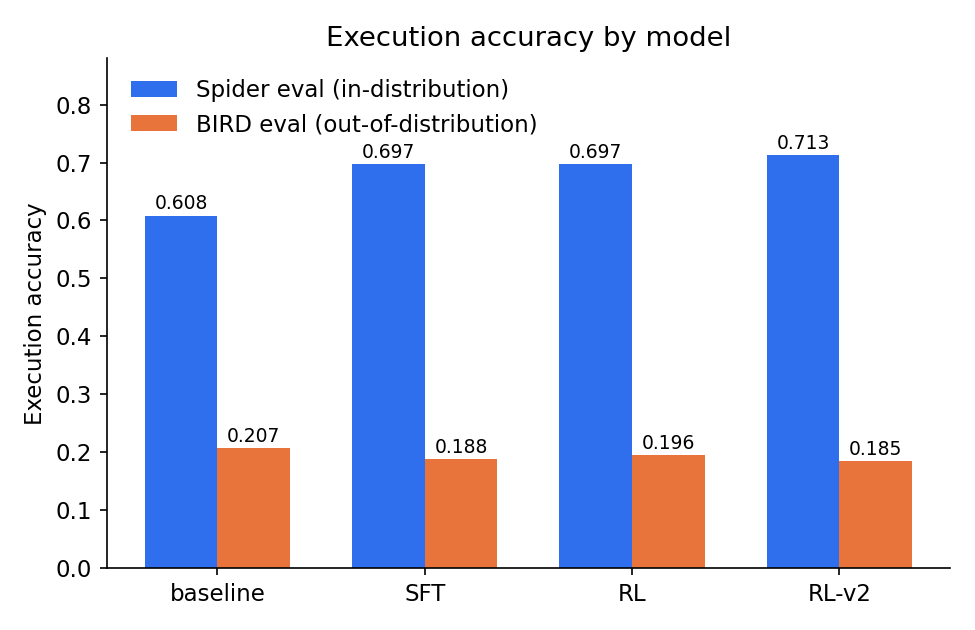
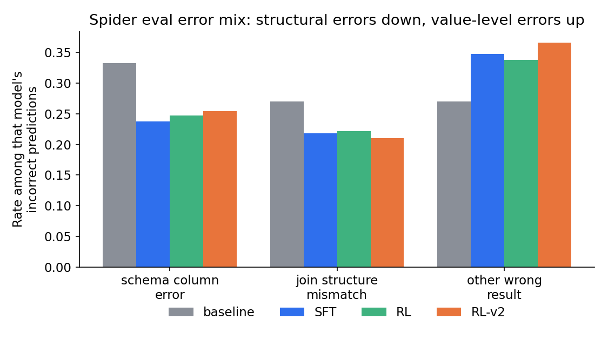

# SFT vs. RL for Text-to-SQL: A Controlled Comparison at 3B Scale

*[byline / date placeholder]*

---

## Abstract

We compare supervised fine-tuning (SFT) and reinforcement learning (RL) as post-training methods for text-to-SQL generation under a controlled experimental design on a single consumer GPU with 8GB VRAM. Starting from Qwen2.5-Coder-3B-Instruct, we train one QLoRA SFT model and two GRPO RL models on the same Spider train (filtered) subset. The second RL model continues from an earlier SFT checkpoint, uses more rollouts, and adds a small partial-credit reward term. We evaluate these three models together with a zero-shot baseline on Spider eval (in-distribution) and BIRD eval (out-of-distribution). SFT and RL obtain the same Spider eval execution accuracy, 0.6973, while RL-v2 improves it further to 0.7128; all three outperform the zero-shot baseline at 0.6083. However, every post-trained model generalizes *worse* than the untouched baseline: the Spider-to-BIRD accuracy drop is 0.4010 for baseline, compared with 0.5095 for SFT, 0.5017 for RL, and 0.5276 for RL-v2. Therefore, post-training clearly improves in-distribution performance, but makes the model worse than doing nothing at retaining this performance out-of-distribution. The main original contribution of this project is a per-category error-taxonomy analysis, since the papers this project scales down from report only aggregate accuracy. The analysis shows that post-training reduces structural errors, including schema-column and join mismatches, but increases value-level errors, such as wrong constants and wrong-but-valid columns, enough to roughly cancel the improvement on BIRD. A second experiment continues training on a small 122-example slice of real BIRD data. SFT-continue improves BIRD continue cross-database EX, while RL-continue on the same data collapses on a same-schema memorization check; the training health logs show why this happens. We release the full training, evaluation, and error-taxonomy pipeline.

## Introduction

Execution accuracy alone cannot tell us *how* a text-to-SQL model is wrong. Two models may obtain exactly the same score on Spider eval while making very different errors on different examples. For example, one may hallucinate column names, another may construct the joins incorrectly, while a third may have the correct structure but use a wrong literal value in the WHERE clause. If post-training changes the dominant failure mode, a single accuracy number cannot show this. Therefore, a statement such as "RL improves text-to-SQL over SFT" does not explain what actually changes underneath the aggregate score.

This project studies a narrower and more answerable version of the question considered in recent large-scale work. SQL-R1, Reasoning-SQL, and Arctic-Text2SQL-R1 all report that RL post-training outperforms SFT-only baselines by several execution-accuracy points at the 7B-32B parameter scale, with compute budgets far beyond a single consumer GPU. Here, we ask whether the same *direction* of effect still appears at 3B scale on hardware that is easy to replicate. We also study a question those papers do not report: which specific failure modes are actually corrected by each post-training method.

There are two main findings. First, the benefit of post-training is entirely in-distribution: every post-trained model generalizes worse from Spider to BIRD than the untouched zero-shot model. At this scale, this is opposite to what a general claim that "RL improves generalization" would suggest. Second, the error taxonomy explains this behavior directly by showing which error categories decrease and which increase after post-training.

## Related work

SQL-R1, Reasoning-SQL, and Arctic-Text2SQL-R1 train Qwen2.5-Coder-family models with GRPO-style, execution-verifiable rewards, and report that RL post-training improves over SFT-only baselines by several execution-accuracy points at 7B-32B scale. In particular, Arctic-Text2SQL-R1 finds that a simple execution-only reward performs better than more complicated partial-credit reward schemes, and that initializing RL from a converged SFT checkpoint performs better than starting RL from an untrained base. This project adopts both design choices directly instead of re-deriving them. Since Qwen2.5-Coder is also the shared base-model family in this literature and OmniSQL, the 3B-scale results here are comparable in type, although not necessarily in magnitude, to those papers.

None of the papers above reports a per-category error breakdown. They report aggregate execution accuracy and, when relevant, the in-distribution-to-out-of-distribution accuracy gap as a single number. The error taxonomy in this project is intended to fill this gap: the goal is not only to see whether accuracy changes, but also to identify which structural or semantic error categories are actually reduced by each post-training method.

## Method

### Model and quantization

All models use exactly the same base model, Qwen2.5-Coder-3B-Instruct. Therefore, the architecture, parameter count, and tokenizer are fixed, and only the post-training procedure changes. Training uses QLoRA: the base weights are quantized to 4-bit NF4 at loading time and then frozen, while LoRA adapters are trained on top in bf16. Since the term "QLoRA" alone does not show the actual configuration choices, the implementation used in this project is given below:

```python
from transformers import AutoModelForCausalLM, BitsAndBytesConfig
from peft import LoraConfig, get_peft_model, prepare_model_for_kbit_training

bnb_config = BitsAndBytesConfig(
    load_in_4bit=True,
    bnb_4bit_quant_type="nf4",
    bnb_4bit_compute_dtype=torch.bfloat16,
    bnb_4bit_use_double_quant=True,
)
model = AutoModelForCausalLM.from_pretrained(
    model_path,
    torch_dtype=torch.bfloat16,
    device_map="auto",
    quantization_config=bnb_config,
    attn_implementation="sdpa",  # avoids materializing the full seq_len x seq_len
                                  # attention matrix at backward time -- the
                                  # difference between OOM and not at 8GB
)
model = prepare_model_for_kbit_training(model, use_gradient_checkpointing=True)

peft_config = LoraConfig(
    r=lora_cfg["r"], lora_alpha=lora_cfg["alpha"], lora_dropout=lora_cfg["dropout"],
    target_modules=lora_cfg["target_modules"], bias="none", task_type="CAUSAL_LM",
)
model = get_peft_model(model, peft_config)
```

Only the adapter is updated or saved, while the base model on disk remains unchanged. This allows the RL model to reload the same frozen base model later and initialize from the SFT adapter. Qwen2.5-Coder-7B-Instruct-GPTQ-Int8 is evaluated only as a zero-shot reference and is never trained. It is excluded from the controlled comparison because it differs from the 3B model in three confounded dimensions at the same time: parameter count, quantization scheme, and training status. Therefore, any performance difference against this model cannot be attributed to a single factor.

### Datasets

Spider train (full) and Spider eval are the main training and in-distribution evaluation sets. Spider train (filtered), the 2000-example subset actually used for training, is a filtered subset of the 8659-example Spider train (full) release rather than the entire training split. BIRD eval is used as the out-of-distribution set. It is not used for training in any of the four core models, so the accuracy gap between Spider eval and BIRD eval is used as the generalization measure. BIRD train, the official training split, is excluded entirely because its per-database files are large enough to be impractical on this hardware, with multi-GB data across roughly 70 real-world databases. Thus, no BIRD-derived data enters the training of the four core models, and BIRD eval remains a clean OOD set. Experiment 2 later trains on a small slice taken from BIRD eval itself, rather than BIRD train; this is a separate and deliberate choice discussed in that section. Spider-DK is also excluded from the core comparison, so the generalization result is based on only one OOD set. This limitation is stated explicitly below.

### Experimental models

We consider four models, and evaluate each of them on both Spider eval and BIRD eval:

- **Baseline** — Qwen2.5-Coder-3B-Instruct, zero-shot, no fine-tuning.
- **SFT** — the same model, LoRA fine-tuned on Spider train (filtered) with standard (question, schema, gold SQL) supervised pairs.
- **RL** — initialized from the SFT checkpoint, trained with GRPO using an execution-only reward.
- **RL-v2** — the same RL setup, but starting from an earlier SFT checkpoint (step 500, not the fully converged final adapter), `num_generations` raised from 2 to 4, and a small partial-credit reward term added.

RL-v2 is introduced because the first RL run obtains exactly the same Spider eval execution accuracy as SFT. The predictions are not only numerically close: they are bit-for-bit identical on 922 of 1034 examples. At the same time, this first RL run has a worse Spider-to-BIRD drop than baseline. RL-v2 therefore tests whether increasing the number of rollouts per prompt and using a denser reward signal changes the result. It does improve Spider eval accuracy from 0.6973 to 0.7128, but the generalization drop becomes worse rather than better, increasing from 0.5017 to 0.5276. The quantitative results are discussed below.

### Metric: execution accuracy

All reported numbers use execution accuracy rather than string match. Both the predicted SQL and the gold SQL are executed on the example's real SQLite database, and a prediction is counted as correct only when it executes without error and returns the same result set as the gold query. Here, "same result" requires one additional convention: comparison is order-insensitive unless the gold query itself contains an ORDER BY clause. This follows the convention of the official Spider and BIRD evaluators, and is implemented as follows:

```python
def execute_query(conn, sql, timeout_sec):
    """Run sql, returning (rows, None) on success or (None, error_str) on failure."""
    try:
        cur = conn.cursor()
        cur.execute(sql)
        return cur.fetchall(), None
    except Exception as e:
        return None, f"{type(e).__name__}: {e}"

def rows_match(gold_rows, pred_rows, order_matters):
    if order_matters:
        return gold_rows == pred_rows
    return sorted(gold_rows) == sorted(pred_rows)
```

Each database is opened in read-only mode. Therefore, a malformed or adversarial prediction cannot modify the database file; it simply fails to execute and is counted as incorrect.

### RL implementation

The RL model uses GRPO through TRL's `GRPOTrainer`, continuing from the SFT model's LoRA adapter rather than starting from a new adapter. GRPO does not require a separate value model or reward model. Instead, the advantage is computed from the mean and standard deviation of multiple sampled completions for each prompt. This is suitable for an execution-verifiable reward and is substantially lighter on an 8GB GPU than PPO's three-model setup. The reward function directly reuses the same `execute_query` and `rows_match` functions shown above, rather than implementing them again. Therefore, the training reward and offline evaluation accuracy use exactly the same computation:

```python
def reward_fn(prompts, completions, db_id, gold_sql, **kwargs):
    rewards = []
    for completion, db, gold in zip(completions, db_id, gold_sql):
        pred_sql = extract_sql(completion)
        conn = get_connection(db_dir, db, conn_cache)
        gold_rows, gold_err = execute_query(conn, gold, timeout_sec)
        if gold_err is not None:
            rewards.append(0.0)   # a bad gold row is a data problem, not a model problem
            continue
        pred_rows, pred_err = execute_query(conn, pred_sql, timeout_sec)
        if pred_err is None and rows_match(gold_rows, pred_rows, "order by" in gold.lower()):
            rewards.append(1.0)
        elif pred_err is None:
            rewards.append(partial_credit)   # executed cleanly, wrong result
        else:
            rewards.append(0.0)
    return rewards
```

One issue appeared immediately in the first RL trial. With TRL's default `temperature=1.0`, `frac_reward_zero_std`—the fraction of sampled GRPO groups in which every completion receives the same score and therefore contributes zero gradient—was 1.0 at every logged step of the full 10-step trial. The training examples were exactly the rows on which the SFT checkpoint had already converged, so resampling at temperature 1.0 continued to produce the same completion every time. Increasing the temperature to 1.3 reduced this value in a follow-up trial, although it did not reduce it to zero. This motivates the ongoing RL health monitoring described below instead of relying only on a single trial run.

### RL Initialization and Training Diagnostics

Because RL starts from the SFT checkpoint, the quality of this initialization is important. RL does not necessarily correct undesirable behaviors already present in the checkpoint and may instead reinforce them through reward optimization. Before RL training, we therefore run a sanity check that measures execution accuracy and execution-error rate, degenerate-output rate, output diversity across questions, and schema-hallucination rate. These diagnostics are intended to capture failure modes that execution accuracy alone cannot identify.

The schema-hallucination rate measures whether a prediction references tables or columns that do not exist in the corresponding database. We implement this check as a lightweight heuristic over quoted SQL identifiers rather than using a full SQL parser. For a dotted reference such as `"alias"."column"`, the method first resolves `alias` to its underlying table, either directly or through an `AS` binding, and then checks `column` against the columns of that table. This is stricter than checking against the union of all columns in the database and can therefore detect cases where a valid column is associated with the wrong table.

Standalone quoted identifiers are checked against the full schema unless they occur in a value position, such as after `=`, `LIKE`, or `IN`, or inside an `IN (...)` clause. These cases are treated as string literals and ignored. This distinction is necessary because calibration on Spider eval gold SQL showed that quoted literal values, such as `WHERE "Airline" = "JetBlue Airways"`, were the main source of false positives. We calibrate the complete heuristic on Spider eval gold SQL, where the measured false-positive rate is 0.0000. A prediction contributes to the hallucination rate if at least one of its identifiers fails the check. The method remains approximate: it does not detect unquoted, backtick, or bracket identifiers, and unresolved aliases such as those introduced by CTEs or subqueries fall back to the more permissive whole-schema check. The same implementation is used during training by `rl_health_callback.py`.

Degenerate outputs require a separate diagnostic because execution-based rewards can occasionally assign full reward to an incorrect or uninformative query. For example, in the `geo` training data, the question "count the states which have elevations lower than what alabama has" has gold answer `0`. The placeholder query `SELECT 1=0` happens to return the same single row as the correct query and therefore receives full execution reward. A policy that increasingly produces such placeholders could appear to improve according to the reward curve while its actual behavior becomes less meaningful.

For this reason, the same diagnostics are repeated periodically during RL training rather than applied only to the initial SFT checkpoint. The callback runs every few hundred optimizer steps and tracks degenerate outputs, schema hallucinations, and the other sanity-check statistics throughout training. This makes it possible to detect reward hacking or template collapse introduced by RL even when these behaviors are absent at initialization.

## Applying and evaluating the three models

### Quantitative results

The full scorecard is available at `runs/blog_artifacts/experiment1_scorecard.txt`. The execution-accuracy rows are:

| model | Spider eval EX | BIRD eval EX | Spider &rarr; BIRD drop |
|---|---|---|---|
| baseline | 0.6083 | 0.2073 | 0.4010 |
| SFT | 0.6973 | 0.1877 | 0.5095 |
| RL | 0.6973 | 0.1956 | 0.5017 |
| RL-v2 | 0.7128 | 0.1851 | 0.5276 |



SFT and RL obtain exactly the same Spider eval accuracy, while RL-v2 improves it further. All three post-trained models clearly outperform baseline in-distribution. However, the Spider-to-BIRD drop tells a different story: the baseline drop of 0.4010 is the smallest among all four models. Therefore, none of the post-trained models improves over the untouched zero-shot model in terms of generalization. Post-training increases Spider eval accuracy but also produces a larger relative drop on BIRD, and RL-v2, which is the strongest in-distribution model, has the largest drop of all.

The full error-taxonomy tables are available at `runs/blog_artifacts/experiment1_error_taxonomy.txt`. The categorization is not based on a SQL parser. Instead, it is a heuristic applied after execution has already determined that a prediction is wrong, using simple regex-based checks on the structural features of the SQL. The main logic is shown below:

```python
def categorize_execution_error(pred_error):
    if "no such table" in pred_error.lower():
        return ["schema_table_error"]
    if "no such column" in pred_error.lower() or "ambiguous column" in pred_error.lower():
        return ["schema_column_error"]
    if any(p in pred_error.lower() for p in ("syntax error", "incomplete input", "malformed")):
        return ["syntax_error"]
    return ["other_execution_error"]

def categorize_wrong_result(pred_sql, gold_sql):
    tags = []
    if len(JOIN_RE.findall(pred_sql)) != len(JOIN_RE.findall(gold_sql)):
        tags.append("join_structure_mismatch")
    if _agg_fns(pred_sql) != _agg_fns(gold_sql) or _has_group_by(pred_sql) != _has_group_by(gold_sql):
        tags.append("aggregation_mismatch")
    if _referenced_tables(pred_sql) != _referenced_tables(gold_sql):
        tags.append("table_reference_mismatch")
    # ... subquery/set-op and order-by/limit checks, same shape
    return tags or ["other_wrong_result"]
```

The relevant Spider eval rows below report the rate of each category among the incorrect predictions of each model:

| category | baseline | SFT | RL | RL-v2 |
|---|---|---|---|---|
| schema_column_error | 0.3325 | 0.2379 | 0.2476 | 0.2542 |
| join_structure_mismatch | 0.2705 | 0.2186 | 0.2219 | 0.2102 |
| other_wrong_result | 0.2705 | 0.3473 | 0.3376 | 0.3661 |



Every post-trained model has a lower schema-column-error rate and a lower join-structure-mismatch rate than baseline. In particular, SFT and RL are better at selecting the correct column and constructing the correct join, which is the kind of structural competence that fine-tuning on gold SQL should teach. However, `other_wrong_result`—the catch-all category for queries that are structurally reasonable but use a wrong value, a wrong-but-plausible column, or a wrong condition—increases from 0.2705 for baseline to about 0.35-0.37 after post-training. Therefore, post-training does not reduce all types of errors uniformly. It replaces some structural errors with value-level errors. On Spider eval, the net effect is still a large accuracy improvement because value-level errors already make up a substantial part of the baseline mistakes. On BIRD eval, the same trade-off remains visible, but the net effect changes sign. This is the mechanism behind the generalization-drop result above rather than a separate phenomenon.

### Case studies

**A clean structural fix.** Consider the same Spider eval question from `concert_singer`: "What are all distinct countries where singers above age 20 are from?" Baseline, SFT, and RL-v2 all answer this question. The gold SQL uses only one table:

```sql
SELECT DISTINCT country FROM singer WHERE age > 20
```

Baseline instead introduces a join that is not required by the question:

```sql
SELECT DISTINCT T1.Country FROM singer AS T1
INNER JOIN singer_in_concert AS T2 ON T1.Singer_ID = T2.Singer_ID
WHERE T1.Age > 20;
```

The query executes successfully and returns a result, so this is not an execution failure. However, the result is silently wrong because `singer_in_concert` can add multiple rows for singers who appeared in multiple concerts. Both SFT and RL-v2 answer correctly and produce queries essentially equivalent to the gold SQL:

```sql
-- SFT
SELECT DISTINCT country FROM singer WHERE age > 20;
-- RL-v2
SELECT DISTINCT Country FROM singer WHERE Age > 20;
```

This example makes the reduction in `join_structure_mismatch` and `schema_column_error` from the table above more concrete. Baseline tends to introduce an unnecessary join when a plausible second table is related to the subject of the question, while post-training reduces this pattern.

**What a syntax error actually looks like.** Consider the SFT prediction on `dog_kennels` for the question, "Find the id, last name and cell phone of the professionals who live in the state of Indiana or have performed more than two treatments." The gold SQL is a clean UNION of two SELECT statements. SFT predicts:

```sql
SELECT professional_id , last_name , cell_number FROM professionals
WHERE state = 'Indiana'
UNION
SELECT t2.professional_id , t1.last_name , t1.cell_number
FROM treatments AS t AS JOIN dogs AS t3 ON t.dog_id = t3.dog_id
AS JOIN professionals AS t1 ON t.professional_id = t1.professional_id
GROUP BY t2.professional_id HAVING COUNT(*) > 2;
```

SQLite returns the error `near "AS": syntax error`. The model writes `AS JOIN` twice, as if a table alias and a join keyword could appear in the same position. This is a specific and reproducible failure mode of this checkpoint. Execution accuracy records only that the prediction is wrong, but it does not show that the underlying join *logic*—three tables with the correct join keys—is closer to the correct structure than the different wrong-join-target error in the previous example.

**The generalization drop, concretely.** Consider RL-v2 on BIRD eval, `california_schools`, for the question, "How many schools with an average score in Math greater than 400 in the SAT test are exclusively virtual?" The gold SQL is:

```sql
SELECT COUNT(DISTINCT T2.School) FROM satscores AS T1
INNER JOIN schools AS T2 ON T1.cds = T2.CDSCode
WHERE T2.Virtual = 'F' AND T1.AvgScrMath > 400
```

RL-v2 predicts:

```sql
SELECT count(*) FROM satscores AS T1 JOIN schools AS T2 ON T1.cds = T2.cds
WHERE T2.virtual = 'Y' AND T1.avgscrmath > 400;
```

There are two compounding errors. First, `schools` uses `CDSCode` as its join key rather than `cds`. The prediction assumes that a foreign-key column has the same name in both tables, a pattern that appears frequently in Spider's synthetic schemas but fails here, so the query does not execute and returns `no such column: T2.cds`. Second, even ignoring the execution error, the *logic* is inverted: the gold query filters `Virtual = 'F'` for "exclusively virtual" schools, while the prediction uses `virtual = 'Y'`, which has the wrong polarity for BIRD's specific flag encoding. Neither error is a Spider eval failure mode. Both are specific to BIRD's real-world column-naming and value-encoding conventions. This explains why post-training that corrects Spider-shaped join errors does not necessarily transfer to BIRD-shaped schema and value errors.

### Additional Error Analysis

The three case studies above illustrate schema linking, syntax errors, and out-of-distribution generalization failures. The complete per-category examples are available in `runs/blog_artifacts/*_gallery.md`, with one file for each model and dataset, and can be regenerated using `scripts/run_blog_artifacts.sh`. Here, we present four additional examples from SFT on Spider eval (`sft_spider_eval_gallery.md`) to illustrate the remaining error categories.

**Value grounding.** For the question "What is the average, minimum, and maximum age for all French singers?", the gold query uses `country = 'France'`, while SFT predicts `Country = "French"`. The selected column and aggregate functions are correct, but the literal value is wrong: the model follows the adjective used in the question instead of the value stored in the database. The query executes successfully but returns `None, None, None`, so the error cannot be detected from execution failure alone.

**Aggregation semantics.** For the question "What is the maximum capacity and the average of all stadiums?", the `stadium` table contains a column named `Average` whose values are already stored in the database. The gold query is therefore `SELECT max(capacity), average FROM stadium`. SFT instead interprets *average* as an aggregation operation and computes `avg(capacity)`, returning `52500, 10621.67` instead of the gold result `52500, 730`. The aggregation operation itself is valid, but the model assigns the wrong semantic meaning to the word *average* in this schema.

**Subquery reasoning.** For the question "How many cars have a larger accelerate than the car with the largest horsepower?", the gold query first uses a subquery to identify the `accelerate` value of the car with the largest horsepower, and then compares the other cars against this value. SFT instead compares `accelerate` directly with `max(horsepower)`. As a result, it compares quantities from two different attributes. The SQL is still executable, but it returns `0` instead of the gold answer `39`.

**Schema hallucination.** For the question "Show the name and the release year of the song by the youngest singer.", SFT joins `singer` with a table named `song`. However, this table does not exist in the database; the song-related attributes are stored directly in `singer`. SQLite therefore returns `no such table: song`. This example shows a table-level schema hallucination rather than the more common case of predicting a nonexistent column.

### Does the RL algorithm choice matter

RLOO and Dr. GRPO are evaluated as algorithm-swap replicates of the RL-continue setup below. The starting checkpoint and training data are kept fixed, and only the optimizer's advantage estimator is changed:

```python
if algo == "dr_grpo":
    # Dr. GRPO (Liu et al. 2025): removes two GRPO biases via config flags.
    # scale_rewards=False drops (r - mean) / std down to plain (r - mean), so a
    # group with a small nonzero std no longer gets its advantage inflated by
    # dividing by that small std. loss_type="dr_grpo" replaces per-sequence-length
    # loss normalization with constant-length normalization.
    trainer_kwargs = dict(scale_rewards=False, loss_type="dr_grpo")
    trainer = GRPOTrainer(model=model, args=GRPOConfig(**shared_kwargs, **trainer_kwargs), ...)
elif algo == "rloo":
    # RLOO (Ahmadian et al. 2024): leave-one-out baseline,
    # advantage = r_i - mean(r_{-i}), no std division at all.
    trainer = RLOOTrainer(model=model, args=RLOOConfig(**shared_kwargs), ...)
else:
    trainer = GRPOTrainer(model=model, args=GRPOConfig(**shared_kwargs), ...)
```

The BIRD continue cross-database EX results for all six variants are shown below (`runs/blog_artifacts/experiment2_scorecard.txt`):

| model | BIRD continue cross-database EX |
|---|---|
| rl-continue (GRPO) | 0.2035 |
| rl-continue-rloo | 0.2054 |
| rl-continue-drgrpo | 0.2035 |
| rl-continue-v2 (GRPO) | 0.2035 |
| rl-continue-v2-rloo | 0.2007 |
| rl-continue-v2-drgrpo | 0.2026 |

The total spread across the six variants is 0.0047. On a 1071-example evaluation set, this is an order of magnitude smaller than the gap between the Spider eval and BIRD eval results of any individual model and is well within noise. Neither changing the advantage estimator nor using the two-phase curriculum in the v2 variants changes this number in a consistent direction. Therefore, this experiment gives a null result rather than evidence in favor of whichever variant happens to obtain the highest value.

## A harder test: adapting to BIRD with a little real data

The second experiment is a harder adaptation test. Starting from the Spider-only SFT checkpoint, we continue training on a small pool of 122 real BIRD examples from two schemas, `california_schools` and `debit_card_specializing`. We compare SFT-continue and RL-continue on three evaluation slices: Spider eval, to check whether continuing on BIRD removes Spider competence; the BIRD continue same-schema slice, which uses the same two schemas but unseen questions and therefore serves as a memorization check; and the BIRD continue cross-database slice, which contains seven databases completely disjoint from the training pool and serves as the actual transfer test.

| model | Spider eval EX | BIRD continue same-schema EX | BIRD continue cross-database EX |
|---|---|---|---|
| sft-continue | 0.6973 | 0.2581 (8/31) | 0.2120 |
| rl-continue | 0.6963 | 0.0323 (1/31) | 0.2035 |

The complete table with all seven continue models is available at `runs/blog_artifacts/experiment2_scorecard.txt`. Two points should be stated precisely. First, SFT-continue obtains 0.2120 BIRD continue cross-database EX, which is higher than the Spider-only SFT and RL-v2 models restricted to the same seven databases by +0.0181 and +0.0171, respectively. Thus, continuing on a small amount of real BIRD data does improve transfer relative to not doing so. However, it still does not reach the untouched zero-shot baseline on the same databases, which obtains 0.2236, leaving a gap of -0.0116. In other words, 122 continue-training examples reduce the gap to zero-shot but do not close it.

Second, RL-continue performs much worse on the BIRD continue same-schema slice: it gets only 1 of 31 questions correct, compared with 8 of 31 for SFT-continue. The comparison uses exactly the same 31 questions, the same starting checkpoint, and the same training pool. The training health log at `runs/bird_adapt_rl/health_log.jsonl` helps explain this behavior:

| step | train_reward_mean | BIRD continue same-schema EX | degenerate_output_rate | schema hallucination rate |
|---|---|---|---|---|
| 10 | 0.061 | 0.0645 | 0.0 | 0.032 |
| 20 | 0.122 | 0.0323 | 0.0 | 0.032 |
| 30 | 0.059 | 0.0323 | 0.0 | 0.032 |
| 40 | 0.197 | 0.0323 | 0.0 | 0.032 |

Training reward increases during the run, so the policy is optimizing the training objective, while BIRD continue same-schema EX drops within the first ten steps and then remains at one correct example for the rest of training. The degenerate-output rate stays at 0.0 and the schema-hallucination rate remains unchanged, so the failure is neither template collapse nor learning to repeatedly output a fixed placeholder. The health monitoring designed for these failure modes confirms this directly. A more plausible explanation is that reward and true correctness become decoupled on such a small training pool. With only 122 training examples, a 40-step GRPO run can increase its own training-batch reward, partly through the partial-credit term for "executed but wrong", without transferring this improvement to the BIRD continue same-schema questions. SFT-continue optimizes a fixed supervised loss directly against gold SQL rather than a sampled partial-credit reward, so it does not have the same failure surface, which is consistent with its higher same-schema result.

## Discussion and limitations

The amount of training data in this project is small compared with SQL-R1, Reasoning-SQL, and Arctic-Text2SQL-R1. Therefore, the absolute accuracy values should not be compared directly with the published results of those papers. At most, the direction of the effects is comparable, and even this comparison should be interpreted cautiously because of the scale difference. The GPTQ-Int8 7B reference model differs simultaneously in parameter count, quantization, and training status, so it is not part of the controlled result. The generalization analysis also uses only one out-of-distribution set, BIRD eval. This limits the strength of the generalization claim, since a second OOD dataset could show whether the observed drop is specific to BIRD or more general. Finally, the error taxonomy is based on regex structural checks rather than a SQL parser and is applied only after execution has already identified a prediction as wrong. It therefore has known limitations documented in the code. For example, `table_reference_mismatch` matches only literal table tokens that follow FROM or JOIN, so it misses tables referenced only inside a subquery by construction.

## Reproducibility

Every number, table, and case-study example in this post is produced directly by the repository's own pipeline. The four core models can be reproduced end to end with `scripts/run_baseline_eval.sh`, `run_sft.sh`, `run_rl_eval.sh`, and `run_bird_eval.sh`; the taxonomy tables use `scripts/error_taxonomy.py` and `compare_error_taxonomy.py`; the BIRD-continue experiment uses `scripts/run_experiment2_chain.sh` and `run_rl_algo_variants_chain.sh`; and `scripts/run_blog_artifacts.sh` regenerates all tables and galleries cited in this post in one pass.

GitHub: https://github.com/levi-hsu/text-to-sql
